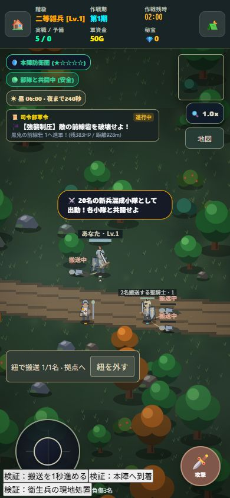

# 負傷者の搬送とクラスアップ秘宝の希少化

2026-10-06 / v1.16.0 / Service Worker `mobile-game-studio-v35`

## 負傷者の扱い

- HP0で負傷ダウン。本人は移動・攻撃不可。
- 通常の兵士と隊長は1名まで紐で引いて搬送する。重装の上位職「聖騎士」だけ2名まで。隊長の覇王化では2名にならない。
- 隊長は45以内に接近すると自動で紐を付ける。一般兵は240以内の未搬送負傷者へ接近し、確保後は近い救護拠点へ帰還する。2人目の回収は160以内。
- 本陣または制圧済みの各探索拠点に入ると全快で復活。未制圧の拠点は救護先にならない。最初から拠点内で倒れた場合も拠点の救護を受ける。
- 現地での復活は衛生兵・大司教だけ。40以内で処置し、最大HPの35%で復活。衛生兵は約0.91秒、大司教は約0.36秒。搬送中の負傷者にも処置可能。
- 未搬送の死亡猶予は従来の14秒。紐で確保中は猶予停止。搬送役がダウン・死亡・不在になれば紐を解除し、残った猶予から再開する。
- 1名搬送は移動速度72%、2名は55%。一般兵の搬送中AIは拠点へ戻る行動を優先する。
- 隊長には「紐を外す」操作を追加。解除直後に同じ隊長へ自動で再接続しないよう、一度65より離れるまで再接続を抑える。
- 休息・会議中は移動と死亡猶予が停止。既に救護拠点に入っている負傷者は休息中も拠点で復活できる。

## 回復の整合性

隊長の接近でその場復活する旧処理を撤去。
サイクル終了時の自費治療、おごり治療、補給拠点の全快、装備や昇進に伴う能力再計算では、ダウン中のHPを回復しない。
拠点の自然回復も、ダウンしていない兵士が実際に本陣内にいる場合に限定する。
搬送だけでは戦闘経験を増やさない。衛生兵の現地復活は実回復として経験判定に記録する。

紐は落ち着いた色の曲線で描画し、負傷者は横たわった体形を表示。負傷者の頭上を「搬送中」に切り替え、隊長のHUDと各兵士カードに搬送数・役割を表示する。
名簿には搬送役と、未搬送の場合は残りの救助猶予を表示する。

## 秘宝の入手

| 敵 | 条件 | 覚醒の英雄宝珠 |
|---|---|---|
| 通常敵 | 全地域 | なし |
| エリート | 本陣から2700以上 | 2%で1個 |
| 通常ボス | 本陣から2700以上 | 12%で1個 |
| 巨大ボス | 本陣から4400以上 | 45%で1個 |

旧来の通常ボス確定・エリート22%・巨大ボス2〜3個確定を撤去し、1体から最大1個に統一。
敵の発生地点の距離で判定し、装備宝箱の抽選とは別扱い。所持済み秘宝は削除せず、昇格の消費は従来どおり1個。

## 保存・検証

負傷者の `carrierId`（隊長は `player`、兵士はID）、位置、残り猶予、解除状態を遠征に保存する。再開時に不在・負傷・定員超過の搬送役との接続を解除する。
旧セーブはそのまま利用可能。旧方式の救助進行は読み込み時にリセットし、旧処理による現地復活を防ぐ。

```text
node tests/state-world.test.mjs
node tests/combat-phase.test.mjs
node tests/equipment-loot.test.mjs
node tests/rest-maintenance.test.mjs
node tests/day-night.test.mjs
node tests/casualty-transport.test.mjs
```

追加テスト：通常1名・聖騎士2名の定員、紐による追従、搬送中の猶予停止、解除・搬送役のダウン、死亡の二重計上防止、本陣・制圧拠点復活、一般兵の現地復活拒否、衛生兵の実回復判定、搬送状態保存、遠隔治療の復活禁止、秘宝確率と実際の討伐経路で最大1個、実際の更新ループでの一般兵の搬送AI。

保存をメモリに隔離したブラウザfixtureで390×844を確認。隊長1名・聖騎士2名の紐と搬送中の姿、名簿の「搬送2/2名」、衛生兵処置で負傷3名→2名、本陣到着で負傷2名→0名を確認。実行エラーなし。



ローカル更新。公開配信とiPhone実機確認は未実施。14秒の確保猶予と搬送速度は長時間プレイで調整の余地がある。
