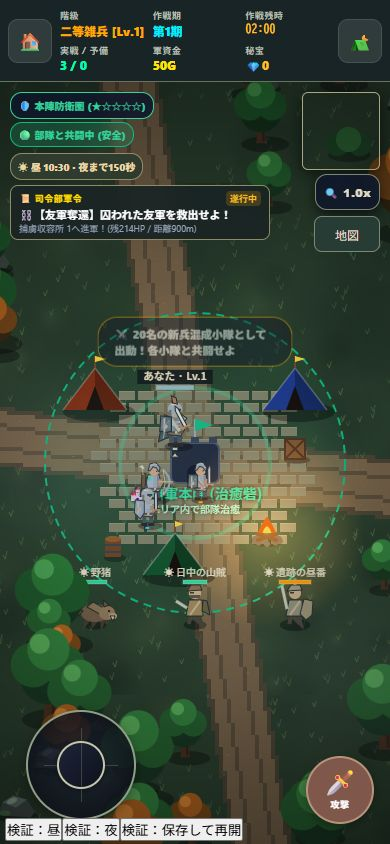
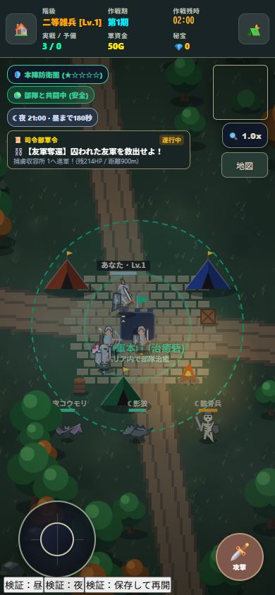

# 昼夜と時間帯限定の敵

2026-10-06 / v1.15.0 / Service Worker `mobile-game-studio-v34`

## 世界時計

- 昼240秒・夜240秒、1日は480秒。ニューゲームは1日目06:00から始まる。
- 昼は06:00〜18:00、夜は18:00〜翌06:00。HUDに時刻・時間帯・次の切替までの実時間を表示する。
- 昼の最後20秒は夕暮れ、夜の最後20秒は夜明け。景観の色調を徐々に変える。
- 夜の暗色レイヤーは最大27%。暗くしすぎず、兵士・地形・敵の視認性を残す。新しい発光・派手なエフェクトは追加しない。
- 世界時計は戦闘と10秒休息中に進む。会議・地図・セーブ選択中は停止。現実の時刻やアプリを閉じた時間には連動しない。
- `worldTime` を遠征ごとに保存。既存セーブに時計がなければ06:00から導入し、所有装備・兵士・進行は保持する。
- 旧来の `performance.now()` だけによる色調の往復を撤去し、景観と出現敵で同じ時計を使う。

## 時間帯限定の敵

| 地域 | 昼限定 | 夜限定 |
|---|---|---|
| 本陣防衛圏 | 野猪 | 夜コウモリ |
| 警戒辺境 | 日中の山賊 | 影狼 |
| 魔境深部 | 遺跡の昼番（エリート） | 骸骨兵（エリート） |
| 最果て | 最果ての昼番（エリート） | 古戦場の骸骨兵（エリート） |

6種類の姿を専用のCanvas描画で追加。野猪の牙と体形、コウモリの翼、影狼の暗い毛並み、山賊の衣服と覆面、昼番の盾と甲冑、骸骨兵の頭骨と骨格を描き分ける。敵の上に名前と昼夜の印を表示する。

生成時は40%で現在の時間帯専用の敵、60%で従来の地域共通敵を選ぶ。共通敵と巨大ボスは昼夜どちらにも存在する。
距離によるHP・攻撃の補正、装備Tier制限、敵の追跡範囲は既存の規則を維持。夜だから近郊で高Tier装備が出ることはない。

日没・夜明けで該当しなくなった限定敵は退去する。討伐金・経験値・撃墜数・宝箱は加算しない。退去した敵への残存投射物も除外する。
休息中に切替が来ても敵は出さず、休止中の敵から対象外の限定敵を除外する。共通のボスの残HPは保持する。

会議の状況タブに、現在の時刻・切替までの時間と、その地域で昼夜それぞれに出る敵を案内する。

## 検証

```text
node tests/state-world.test.mjs
node tests/combat-phase.test.mjs
node tests/equipment-loot.test.mjs
node tests/rest-maintenance.test.mjs
node tests/day-night.test.mjs
```

時計境界（240/480秒）、夕暮れ・夜明けの連続した色調、時間帯と地域別の生成、共通敵の維持、退去で報酬が入らないこと、休息中の時計・会議中の停止、夜と休息の保存・再開、6種類の描画を検証。

ブラウザは保存をメモリに隔離したfixtureで390×844を確認。10:30の昼と21:00の夜、限定敵の各姿、時計の夜まで150秒・昼まで180秒を確認。夜の保存を再開して21:00を保持、会議の地域案内を確認。横方向のはみ出しなし、時間帯HUDと軍令の重なりなし、実行エラーなし。
画像では各地域の限定敵を並べ、姿を比較しやすくしている。実際の生成は上表の地域に従う。





ローカル更新。公開サイトへの配信とiPhone実機での確認は未実施。限定敵の遭遇頻度や長期的な難易度はプレイ感に応じ調整する。
