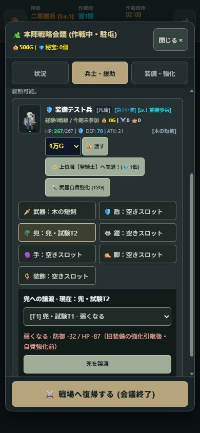
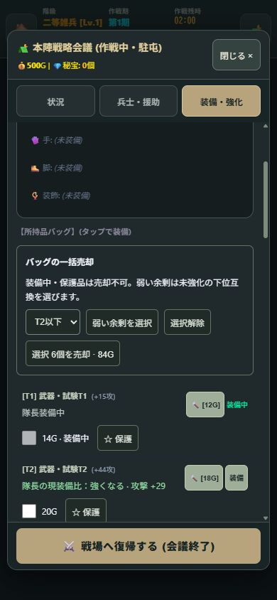

# 装備UI・一括売却・距離スケーリング

2026-10-06 / v1.13.0 / Service Worker `mobile-game-studio-v32`

## 操作

- 会議 →「兵士・援助」：兵士ごとに武器・盾・兜・鎧・手・脚・装飾を常時表示。未装備は「空きスロット」。部位を押すとその部位の譲渡候補を表示する。
- 候補はバッグと隊長装備。隊長装備の譲渡では隊長から外れる。兵士・予備兵の装備は候補にしない。旧装備はバッグに戻る。
- 現装備比を「強くなる / 弱くなる / 一長一短 / 同等」と能力値の増減で表示。色だけに依存しない。
- 兵士の比較は旧装備から強化を引き継いだ状態。自費の追加強化前の装備値を比較する。隊長のバッグは通常装備時と、可能なら強化引継後を別表示する。職業・才能等を含む最終能力値ではなく装備そのものの差分。
- 会議 →「装備・強化」：チェックで売却対象を選択。「弱い余剰を選択」は指定Tier以下の未強化品で、他のバッグ品または隊長装備に全能力で劣る品を選ぶ。同能力の重複は1個を残す。兵士が強い品を持っているだけでは隊長用の候補を処分しない。
- 売却前に個数と合計金額を表示。「☆ 保護」で売却対象から除外。隊長・兵士・予備兵の装備中アイテムと宝珠は売却不可。売却実行時も再検証し、重複IDで二重支払いしない。
- 自動売却は行わない。強化品の手動売却は可能。保護状態は遠征に保存、売却チェックと部位の選択は一時UI状態。

## 距離と装備

距離は本陣からのゲーム内座標距離。経過サイクルでTier上限は上がらない。

| 距離 | 通常敵・砦の装備 | エリート・通常ボスの例外 |
|---|---|---|
| 0〜1199 | T1〜T2 | 上限T2 |
| 1200〜2699 | T1〜T3 | 2300以遠で稀にT4 |
| 2700〜4399 | T2〜T4 | 3800以遠で稀にT5 |
| 4400以遠 | T3〜T5 | 5200以遠で稀にT6 |

巨大ボスは4400〜5999でT5〜T6、6000以遠でT6(80%)・T7(20%)。T7は巨大ボス限定。抽選したTierと名称・能力値を同時生成する（旧コードのTierだけ強制上書きを撤去）。
通常敵の装備ドロップ率は距離に応じ12〜16%、エリート55%、ボス100%。

## 難易度・報酬

- 通常敵のHP・攻撃倍率は本陣からの距離で連続補間。600→1200→2700→4400→7400で段階的に上がる。敵種の強さも地域に応じ変わる。
- 経過サイクル補正は1期ごと+2.5%、最大+60%。本陣の敵が時間だけで無制限に強くなることを防ぐ。巨大ボスも時間補正を同じ上限に統一。
- 経験値・討伐金・砦金・巨大ボス追加金は距離で増加。討伐品・討伐報酬は敵の発生位置の距離を使う。
- 通常敵は発生地点から650、ボスは900を超えて追跡すると帰還する。遠方の強敵の本陣までの追跡を抑える。
- 拠点耐久も距離で増加。既存遠征を再開すると拠点の残HP比率を維持して調整する。
- 祭壇の無料強化上限は近郊+2 / 辺境+5 / 深部+8 / 最果て+12。既に強い装備は下げない。鍛冶・自費強化は別。
- 現行セーブと所有済み装備のTier・能力値は保持。過去に手に入れた高Tierを削除しない。

## 検証

以下すべてPASS：

```text
node tests/state-world.test.mjs
node tests/combat-phase.test.mjs
node tests/equipment-loot.test.mjs
```

追加テスト：全7部位の譲渡、隊長からの取り外し、旧装備返却・強化引継、存在しない品の拒否、予備兵装備・保護品・宝珠の売却防止、重複ID、余剰選択、強弱・一長一短比較、距離別抽選上限、距離補間と時間補正上限、近郊祭壇の上限、9999期でも近郊砦のT2上限。

ブラウザ検証はメモリ保存だけの専用fixtureで実施。390×844で7部位、弱い兜「防御−32 / HP−87」、T2盾の譲渡、余剰6個84Gの選択と売却（500G→584G）、装備中・保護品の保持を確認。横方向のページはみ出しなし。既存の実セーブも再開し26名の部位UI表示・実行エラーなしを確認。
初回fixtureのメモリ保存削除モックの戻り値不足による初期化エラーは修正後に再検証した。

画像：





端末実機での操作と長時間のプレイバランスは未検証。ローカル更新のみで、公開サイトへの配信は未実施。
