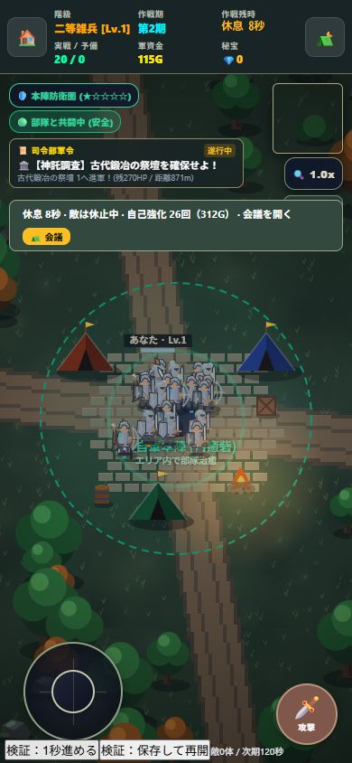
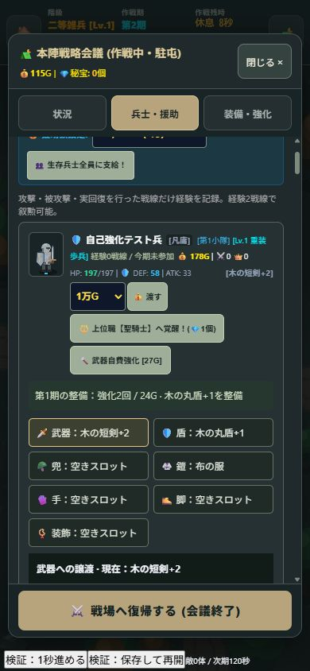

# 10秒の休息と兵士の自動自己強化

2026-10-06 / v1.14.0 / Service Worker `mobile-game-studio-v33`

## 現行仕様

120秒戦闘 → 10秒休息 → 次の120秒戦闘。自動で繰り返す。
休息中は敵の出現と戦闘・移動を停止。生きている敵は休止し、残HPを保持して休息後に戻る。飛翔物は休息開始時に除去する。
休息で敵を消しても討伐・金・経験値・ドロップは加算しない。新兵供給と実戦参加者だけの戦線経験判定は維持する。

## 自己強化が進みにくかった理由と変更

以前のサイクル給与は隊長にだけ入っていた。兵士は討伐金などから治療費を払った残額で強化し、さらに12Gの余力が必要だった。
現在はサイクル終了時、既存の生存兵士・予備兵の財布へ各20Gを支給する。新着兵は従来の初期所持金で整備し、次回から給与対象。
治療を優先した後、休息中に以下のルールで整備する。

- 1秒ごとに各兵士が最大1部位を強化（次のラウンド開始まで8秒で最大8回）。
- 強化値の低い部位を優先し、同じ強化値なら安い部位から選ぶ。全7部位が対象。
- 兵士自身の所持金で支払い、維持費6Gを残す。隊長の金は消費しない。
- 自動強化上限は+30。資金不足、装備なし、負傷ダウン、上限では強化しない。
- 自費治療で残金がなくなった兵士は強化できないことがある。理由を個別表示する。
- 休息中の強化・治療を新期の戦闘参加として数えない。

## UI・手動操作・保存

- フィールドの休息カウントダウンとバナーに自己強化の回数・消費金を表示する。
- バナーの会議ボタンから整備・援助・譲渡・売却などの従来操作を使える。
- 会議中は休息時計と自動強化も停止。閉じると残り時間から再開する。
- 会議の状況タブに全体集計、兵士カードと予備兵名簿に個別実績・理由を表示。
- 戦闘中にも従来の会議・手動強化・援助は利用できる。
- `restTimer`, `restUpgradeClock`, `restReport`, `restMonsters` を遠征に保存。兵士の `lastMaintenance` も保存。
- 休息途中で再開しても給与や完了済み強化を繰り返さない。既存遠征は新しい保存フィールドがなくても戦闘から再開できる。所有装備と現在のセーブを保持する。

## 検証

```text
node tests/state-world.test.mjs
node tests/combat-phase.test.mjs
node tests/equipment-loot.test.mjs
node tests/rest-maintenance.test.mjs
```

休息の10秒、直接生成を含む敵の出現停止、給与の二重支給防止、秒ごとの自己強化、会議中の停止、手動強化の併用、保存・再開、ボスの残HP保持、次期120秒、資金不足・負傷・+30上限を検証。

ブラウザはメモリ保存専用fixtureで390×844を確認。休息8秒時点で敵0体・自動強化26回312G、個別2回24Gを表示。手動で武器+1→+2（18G消費）も成功。会議を開いても時計は8秒のまま。
途中保存を読み直し、残り1秒まで敵0体、10秒終了時に敵42体と次期02:00へ復帰。実行エラーなし。





ローカル更新。公開配信とiPhone実機での確認は未実施。長期的な給与・強化速度のバランスはプレイ感を見て調整する。
