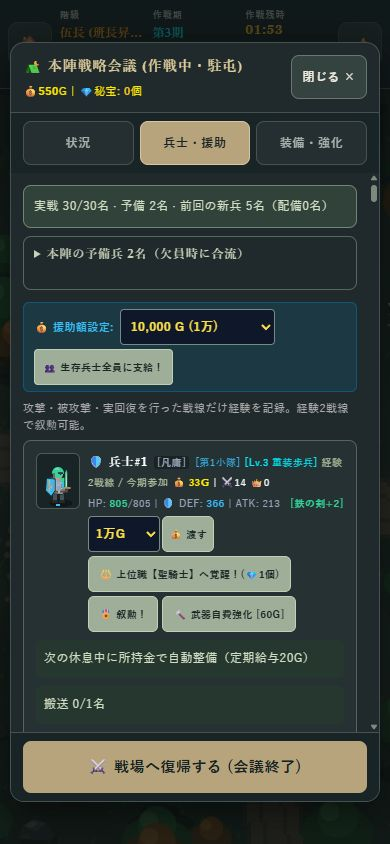

# 出動30名・敵の増員・UI字体

2026-10-06 / v1.17.0 / Service Worker `mobile-game-studio-v36`

## 出動数

- 全階級の定員を30名に統一。ニューゲームも新兵30名から開始する。
- 昇進による直属随伴人数・指揮権・能力ボーナスは維持。昇進による出動枠の拡大は終了。
- 30名を超える兵士は予備に保存する。既存遠征の再開では予備から30名まで配備する。
- 予備が足りない場合、既存の毎サイクル新兵供給で欠員を埋める。既存兵士・装備・進行は保持。
- 定員は `DEPLOYMENT_CAPACITY` に集約し、階級表・開始処理・HUDの表示を一致させた。

## 敵の増員

| 項目 | 旧 | 現行 |
|---|---:|---:|
| 初期敵数 | 42 | 70 |
| 本陣防衛圏 | 6 | 10 |
| 警戒辺境 | 16 | 24 |
| 魔境深部 | 14 | 24 |
| 最果て | 6 | 12 |
| 維持上限 | 46 | 72 |
| 通常敵の補充間隔 | 0.75秒 | 0.45秒 |

維持上限にはボスも含む。上限に達していると巨大ボスは空きができるまで待機する。
遠い地域の通常敵を整理して近場へ補充する既存処理を維持しているため、常に70体が画面内にいるわけではない。
10秒休息中の出現停止、昼夜限定敵、距離による強さと装備Tier、秘宝の低確率抽選は維持。

## 字体

- 見出し・兵士名・階級表示は明朝系の字体で軍務記録らしい雰囲気にした。
- 本文・ボタン・セレクターはゴシック系に統一。操作部分には少し字間を付け、見出しと役割を分けた。
- 時間・所持金などは桁幅を揃える設定を追加。
- 端末の既存フォントを使い、外部フォントのダウンロードは不要。日本語見出しはiPhoneのヒラギノ明朝、Windowsの游明朝などへフォールバックする。表示字体は端末により異なる。

## 検証

```text
node iron-squad/tests/state-world.test.mjs
node iron-squad/tests/combat-phase.test.mjs
node iron-squad/tests/equipment-loot.test.mjs
node iron-squad/tests/rest-maintenance.test.mjs
node iron-squad/tests/day-night.test.mjs
node iron-squad/tests/casualty-transport.test.mjs
node iron-squad/tests/population.test.mjs
```

追加テスト：全階級30名、初期敵数と地域別配置、45名だった旧部隊を30名＋予備15名に保持、予備からの再配備と残り時間の保持、補充間隔、ボス込み72体上限、満員時の巨大ボス待機、休息中の敵停止。
既存の戦線テストは出動30名に更新した。

390×844のブラウザで既存遠征を再開し、実戦30/30名・予備2名を確認。見出しとボタンの字体適用、横方向のはみ出しなし、戦場復帰ボタンが画面内に表示されること、実行エラーなしを確認。



ローカル更新。公開配信、iPhone実機の字体・戦闘負荷の確認は未実施。
